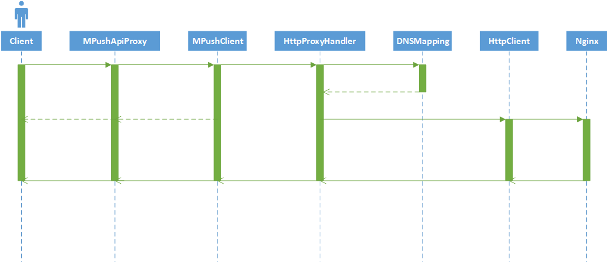

# HTTP代理

## 使用场景
* 问题
  > 前面有提到过http代理这个东西，但很多人不知道这个东西该怎么用，或者说有什么用？以及在什么场景下使用？

* 移动APP通信场景分析
  > 从使用的链接情况来看，一般可以分为两大类：TCP长链接，HTTP短链接；长链接用于消息推送或IM等场景，HTTP用于业务数据的查询或修改。虽然不是所有的APP都需要IM功能，但大多应用都需要消息推送功能。为了推送消息，APP必须维持一根长链接，但大部分时间除了心跳这根链接上是没多少消息在传输的，特别是非IM类的APP，因为这类应用并没大量的消息要不停的推送，维持长链接只是为了消息的及时到达，这势必造成了很大的资源浪费！

* 解决方案

  > 针对上述情况MPUSH提供了Http代理方案，目的一是充分利用push通道，而是提高数据传输效率节省电量，节省流量，提供比http更高的安全性。

* 实现原理

  > MPushClient 提供了一个叫`sendHttp`的方法，该方法用于把客户端原本要通过HTTP方式发送的请求，__全部通过PUSH通道转发__，实现整个链路的长链接化；通过这种方式应用大大减少Http短链接频繁的创建，不仅仅节省电量，经过测试证明请求时间比原来至少缩短一倍，而且MPush提供的还有数据压缩功能，对于比较大的数据还能大大节省流量(压缩率4-10倍)，更重要的是所有通过代理的数据都是加密后传输的，大大提高了安全性！

## 使用方式

* 服务端

  1. 修改`mpush.conf`增加`mp.http.proxy-enabled=true`启用http代理

  2. 修改`mpush.conf`增加`dns-mapping`配置，示例如下

     ```java
     mp.http.dns-mapping={//域名映射外网地址转内部IP
       "api.jituancaiyun.com":["10.0.10.1:8080", "10.0.10.2:8080"]
     }
     ```

     ​

     > 说明：因为`mpush server`要做http代理转发，而客户端传过来的一般是域名比如`http://api.jituancaiyun.com/get/userInfo.json`为了不到公网上再绕一圈建议把mpush server 和业务服务(api.jituancaiyun.com)部署到同一个局域网，并增域名api.jituancaiyun.com到提供该服务的集群机器内网ip之间的一个映射，这样`mpush server`就可以通过局域网把请求转发到具体到业务服务，效率更高！

* 客户端

  1. 设置`ClientConfig.setEnableHttpProxy(true)`来启用客户端代理。

  2. 通过`Client.sendHttp(HttpRequest request)`方法来发送请求。

     > AndroidSDK通过`com.mpush.android.MPush#sendHttpProxy(HttpRequest request)`来发送比较合适。

## 流程分析

### 流程图



### 说明

1. `Client`代表App业务比如查询用户信息的接口
2. `MPushApiProxy`是一个工具类用于负责处理当前请求是使用普通的HTTP还是使用MPush长链接通道，这个类在SDK中说不存在的，是我们公司内部的业务，实现起来也很简单，建议Android工程中增加这么一个角色，而不是到处直接去依赖Mpush的代码，方便以后解耦。
3. `MPushClient `这个SDK已经提供，用于把Http协议打包成mpush协议。
4. `HttpProxyHandler`__包括后面的几个组件都是服务端业务组件。__用于接收客户端传过来的请求并反解为Http协议，然后通过DNSMapping找到域名对应的局域网IP，再通过内置的HttpClient，把请求转发给业务WEB服务，并把业务服务的返回值(HttpResponse)打包成MPush协议发送到客户端。
5. `DNSMapping`负责通过域名解析成局域网IP，并具有负载均衡以及简单的健康检查功能(针对所配置的WEB服务)
6. `HttpClient`目前使用的是用`Netty`实现的全异步的一个`HttpClient`，负责通过http的方式请求业务服务。
7. Nginx是业务服务，也可以是Tomcat，__特别需要建议的是链接超时时间配置长一些。__


### 补充

为什么要这样实现？因为这样做对原有的业务系统侵入特别低，如果`MPushApiProxy`这个组件设计的好，对于最两边的业务组件/服务(Client,Nginx)，对请求方式应该是无感知的，这个角色是无法区分到底请求是通过普通的Http方式发送出去的还是通过长链接代理的方式发送的！！！